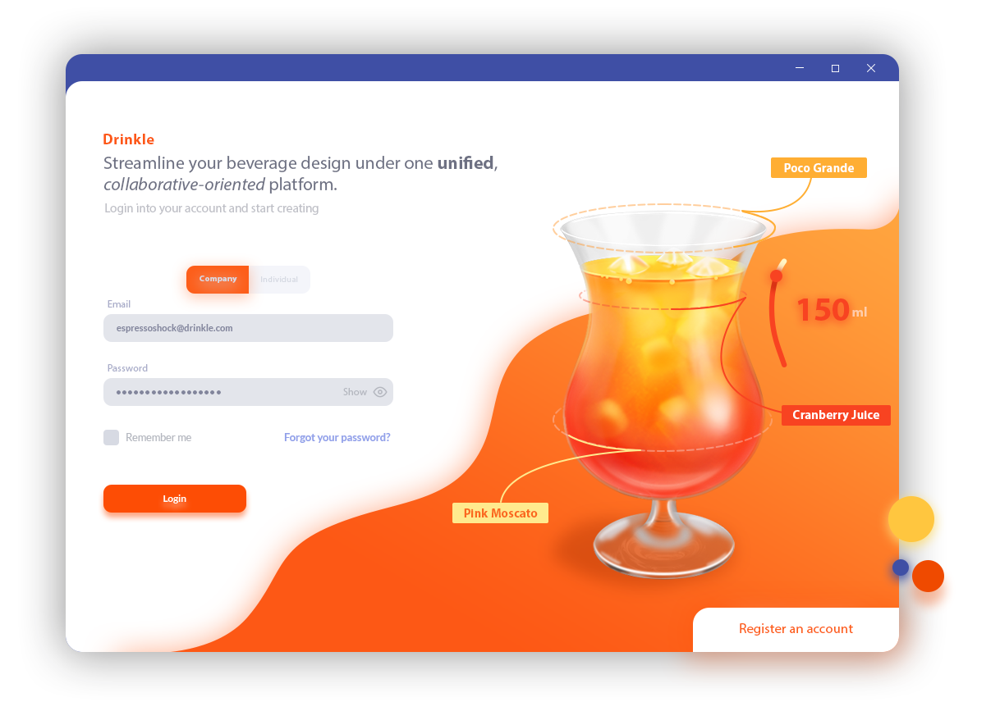
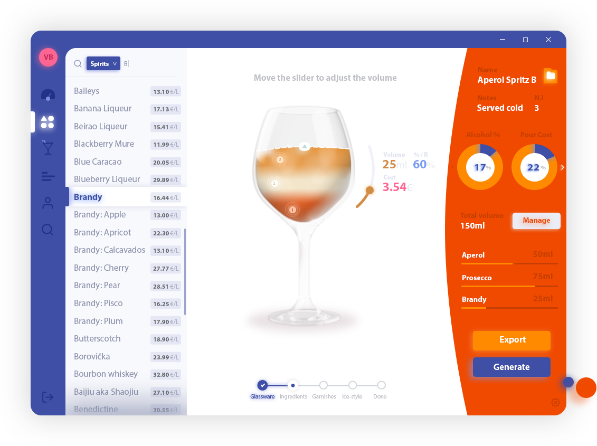
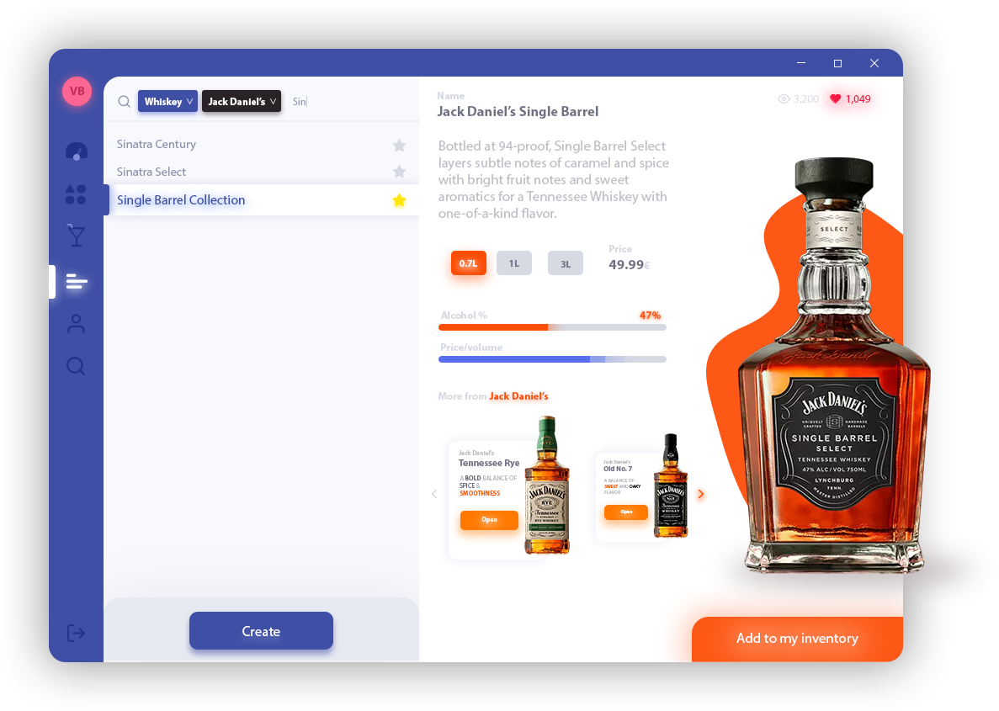
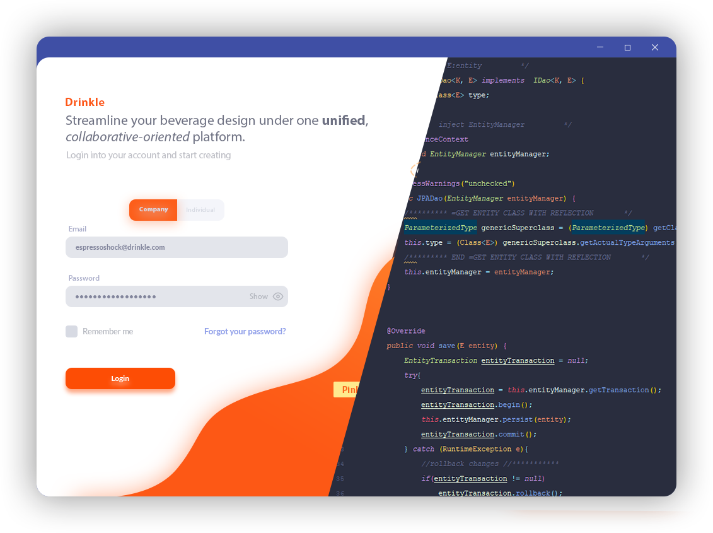
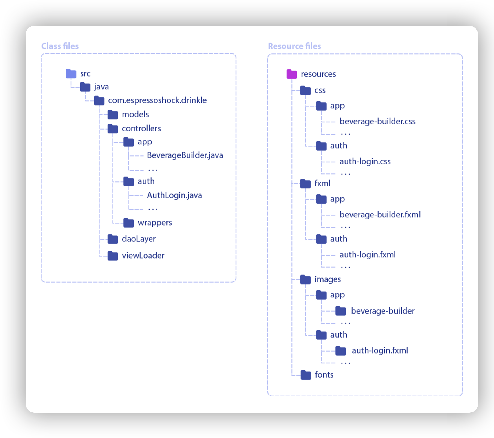

# Drinkle <!-- omit in toc -->
> Comprehensive recipe-development Java toolkit that streamlines the beverage development
process under one unified, visually stunning, collaboration-oriented platform. 

    

## Table of contents <!-- omit in toc -->
- [Description](#description)
- [Presentation and Demo](#presentation-and-demo)
- [Designed for large teams, sized for everyone](#designed-for-large-teams-sized-for-everyone)
  - [Features](#features)
    - [Borderless custom designed window | Handcrafted UI for a better UX](#borderless-custom-designed-window--handcrafted-ui-for-a-better-ux)
    - [Data persistency: Hibernate ORM, DAO layer, 1:1 table mapping](#data-persistency-hibernate-orm-dao-layer-11-table-mapping)
    - [Speed and perception of speed: Asynchronous Queries](#speed-and-perception-of-speed-asynchronous-queries)
    - [A better project structuring approach: Folder mirroring](#a-better-project-structuring-approach-folder-mirroring)
    - [A more human experience: animations and micro-interactions](#a-more-human-experience-animations-and-micro-interactions)
    - [Encryption and recovery code generator: MD5, SHA, Salt](#encryption-and-recovery-code-generator-md5-sha-salt)
    - [ViewLoader: A better view and resource management](#viewloader-a-better-view-and-resource-management)
    - [TLS/SSL Support](#tlsssl-support)
  - [Views](#views)
  - [License](#license)

# Description

**Drinkle** is comprehensive _recipe-development toolkit_ that streamlines the beverage development
process, integrating each and every development procedure, from the ingredient design to the BOM
generation, under one _unified_, visually stunning, _collaboration-oriented_ platform. Since recipe
development plays an essential role in brand identity the main application’s target are small, mediumsized companies that, within the same software, with a centralized approach, can easily manage their
employees and recipes, granting _custom permissions_ and assigning _ad-hoc roles_ per recipe. With
businesses in mind, bill of materials, recipe guidelines and menus can also be, with ease of use, exported
within the same platform. In view of the fact that creating, recording and sharing recipes, at the time of
this paper, represents a tedious process due to a lack of standardized norms and tools in the prosumer
market sector, the software integrates a version for privates with limited functionalities that allows to
visually design and share cocktail recipes in a structured easy-to-read manner.

# Presentation and Demo

Please refer to the reference presentation: [here](https://docs.google.com/presentation/d/1w5zrBLGi4VVSG6JO1CFkwTLYUqz0Lx-aBbNywcKlcnU/present?usp=sharing)

# Designed for large teams, sized for everyone

Streamlines the beverage development process, integrating each and every development procedure, from the ingredient design to the BOM generation, under one unified, visually stunning, collaboration-oriented platform.

    

## Features

### Borderless custom designed window | Handcrafted UI for a better UX

In order to provide a more *natural user-experience*, a custom card-based **borderless window** has been adopted with built-in custom controls and shadows. Each and every **graphics and illustration** has been **handcrafted** for the best results.

    

### Data persistency: Hibernate ORM, DAO layer, 1:1 table mapping

Due to the intrinsic *data-driven* nature of the application has been decided to adopt the **Hibernate ORM** along with a thin **generic type-safe DAO Layer** allowing to have a *1:1 table-object mapping* with **auto commit over data-persistance operations**.

    

### Speed and perception of speed: Asynchronous Queries

In order to provide a more modern, smooth and human user-experience a *means of parallelism* has been required to be implemented, *running each database query asynchronously* in a **non-blocking** fashion without blocking or freezing the UI on top of the JPAs.

    

### A better project structuring approach: Folder mirroring

As being the main goal *maximizing work throughput* and *reducing conflicts* and refactorings, during the design phase has been adopted a **folder mirroring strategy** along with all the common practices regarding *Java, JavaFX, MVC and MySQL*.

    

### A more human experience: animations and micro-interactions

Following the *research of a more natural and effective user-experience* the application has been crafted with **meaningful animations**, **transitions** and **micro-interactions**.

    

### Encryption and recovery code generator: MD5, SHA, Salt

All the *passwords and sensitive information* are **encrypted** to ensure user’s privacy and data safety. **MD5** and **SHA** (SHA-2 with 32-bit words or 64-bit words) are both supported and interchangeable and both supports supplementary Salt.

The **Recovery code** is also **encrypted** and generated based upon a *user-defined dictionary that defines its code pattern*.

    

### ViewLoader: A better view and resource management

With the objective to fulfill the need for a better and more *centralized way* to manage views and their resources along with the goal to implement a **SSOT architecture** a custom ViewLoader has been implemented with the task to manages *views, resources and their loading and injection process*.

    

    

## License

[MIT](http://opensource.org/licenses/MIT)
